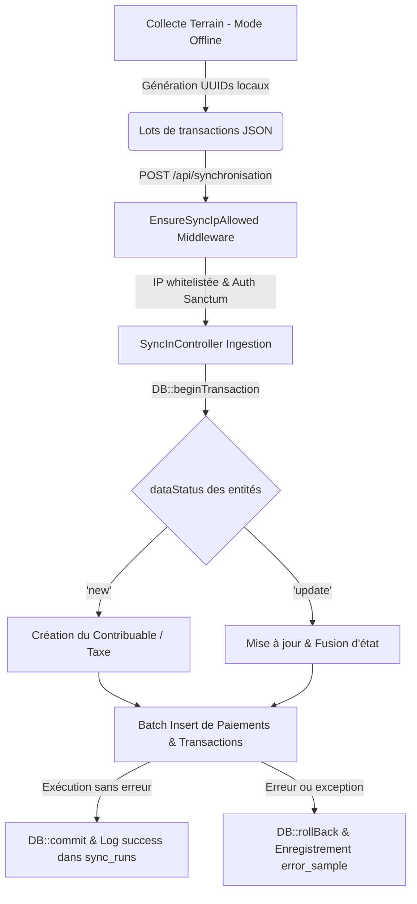
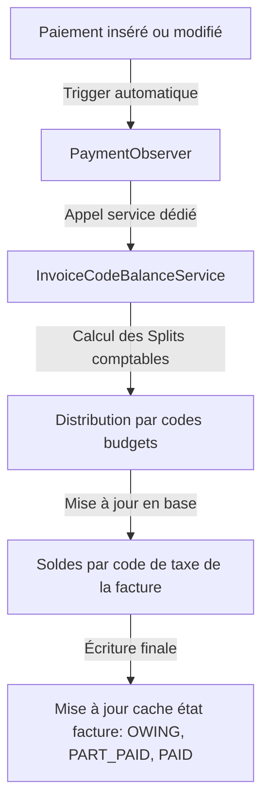

# Comment j'ai transformé un moteur de synchronisation instable en infrastructure financière fiable

La première fois que j'ai touché à ce logiciel, c'était dans des conditions très différentes de celles d'aujourd'hui. Terrain, contraintes matérielles, délais serrés et souvent des décisions prises "parce qu'il fallait avancer" plutôt que parce qu'elles étaient les meilleures. On résolvait ce qu'on pouvait, quand on pouvait, avec ce qu'on avait. Ce n'est pas une excuse, c'est juste la réalité du développement hors des conditions idéales.

Avec deux ans de plus et des projets bien plus exigeants dans les pattes, je regarde ce travail d'époque avec des yeux différents. Il y a des choix que je ne referais pas, des raccourcis qui m'ont coûté du temps plus tard, et des choses que je n'avais tout simplement pas encore les outils pour concevoir autrement. Ce que vous allez lire ici, c'est le résultat de ce recul. Ce projet m'a surtout appris qu'il vaut mieux poser les bonnes fondations dès le départ. Beaucoup des problèmes que cet article traite auraient pu ne jamais exister.


Dans le secteur public, les logiciels de gestion financière ont une particularité : quand ils tombent, ce ne sont pas des clients qui râlent, ce sont des agents qui ne peuvent plus travailler et des recettes fiscales qui stagnent. C'est dans ce contexte que j'ai pris la responsabilité de refondre **X-RECETTE**, un progiciel qui gère le cycle fiscal complet de plusieurs municipalités — du recensement des contribuables jusqu'à la ventilation budgétaire des recettes — bâti sur Laravel 10 et Livewire 3.

Au départ, la demande était vague : "stabiliser la synchronisation". En réalité, le périmètre était bien plus large.

## D'abord, le contexte fiscal pour les non-initiés

Si vous n'avez jamais travaillé dans le secteur public, certains termes de cet article peuvent sembler opaques. Voici les quatre notions qui reviennent tout au long de l'article :

- Le **contribuable** est le citoyen ou l'entreprise assujetti à une ou plusieurs taxes locales (taxe foncière, taxe de balayage, contribution d'aménagement, etc.).
- L'**avis d'imposition** est le document officiel émis par la mairie qui liste les taxes dues par un contribuable pour un exercice fiscal donné. Un seul avis peut regrouper plusieurs taxes distinctes.
- Le **régisseur** est l'agent municipal habilité à encaisser les recettes fiscales et à valider les opérations comptables. C'est lui qui utilise l'interface web au quotidien.
- La **ventilation budgétaire** désigne la répartition d'un paiement entre les différents codes budgétaires concernés. Quand un contribuable règle son avis, chaque franc encaissé doit être imputé à la bonne ligne budgétaire : le Trésor public ne tolère aucune approximation là-dessus.


## Ce qu'on avait avant : un système qui fonctionnait jusqu'au moment où il ne fonctionnait plus

Imaginez un agent de recette qui attend la fin d'une importation de 5 000 paiements pour continuer son travail. Quatre minutes de chargement, puis une erreur 500. Il recommence. Même résultat. C'était la norme.

Quand j'ai audité l'application, trois problèmes structurels ressortaient clairement.

La logique métier était enfouie dans des contrôleurs de plusieurs centaines de lignes, où validation, accès aux données et effets de bord se mélangeaient sans aucune couche d'isolation. Les imports se faisaient de manière synchrone dans le cycle HTTP : le navigateur de l'agent restait bloqué pendant toute la durée du traitement, et sur les gros volumes, le processus PHP crevait soit par timeout, soit par dépassement mémoire (OOM). Et quand ça cassait  ce qui arrivait souvent  personne ne savait exactement à quel enregistrement le processus s'était arrêté ni pourquoi.

La stratégie de refonte a donc reposé sur trois axes : rendre la synchronisation résiliente, basculer les traitements lourds en asynchrone, et restructurer le code autour d'intentions métier explicites.


## La synchronisation différentielle et la traçabilité

Le premier chantier était de mettre fin au mode "tout ou rien". Auparavant, chaque import repartait de zéro. Si quelque chose cassait à mi-parcours, on ne savait pas où on en était et on recommençait depuis le début, ce qui pouvait prendre 20 à 30 minutes sur des gros volumes.

J'ai introduit un curseur basé sur `updated_at` et une table `sync_runs` qui enregistre l'état de chaque cycle :

```php
$lastSuccess = SyncRun::where('entity', 'payments')
    ->where('status', 'success')
    ->orderByDesc('finished_at')
    ->first();

$cursor = $lastSuccess ? $lastSuccess->meta['last_synced_at'] : null;
```

À chaque exécution, on ne récupère que ce qui a changé depuis la dernière synchronisation réussie. Si un job s'interrompt, il reprend exactement là où il en était au prochain déclenchement. La table `sync_runs` enregistre aussi les erreurs : statut, volume traité, et un extrait JSON de la donnée qui a provoqué le rejet (`error_sample`). En production, ça a changé complètement la façon dont l'équipe technique gère les incidents  on passe de "je ne sais pas ce qui s'est passé" à "le lot 47 a échoué sur ce contribuable précis pour cette raison".


## L'architecture offline-first pour les agents terrain

X-RECETTE ne vit pas uniquement en mairie. Des agents de collecte utilisent des terminaux mobiles sur le terrain  marchés, zones rurales, quartiers peu connectés  et remontent les données lors du retour en zone réseau. La synchronisation devait donc fonctionner dans les deux sens, y compris quand le terminal n'avait aucune connectivité pendant des heures.

Voici comment le flux d'ingestion fonctionne :



Le premier problème à résoudre était les conflits de clés primaires. Quand deux terminaux différents créent localement un contribuable en même temps, leurs identifiants auto-incrémentaux entrent en collision lors de la fusion. J'ai migré l'ensemble des tables concernées vers des UUIDs générés directement côté client mobile. Ça supprime la classe entière des conflits d'ID à la racine.

L'ingestion elle-même se fait dans une transaction base de données isolée. L'algorithme détecte le statut de chaque donnée (`dataStatus = new` ou `update`), traite les créations, insère les éléments imposables par lots, et met à jour les historiques de façon atomique. Si n'importe quelle étape échoue, tout le lot est annulé proprement et l'erreur est tracée sans jamais toucher à la base centrale.


## Passage à l'asynchrone : libérer l'interface utilisateur

L'autre grand changement, plus simple à décrire mais immédiatement visible pour les utilisateurs, a été de passer de `QUEUE_CONNECTION=sync` à `QUEUE_CONNECTION=database`.

Avec la configuration synchrone, chaque import bloquait le thread PHP jusqu'à la fin. En déportant les jobs (`SyncImportPaymentsJob`, `DownloadMultipleInvoiceAction` et les autres) vers des workers en arrière-plan, l'interface de l'agent redevient disponible immédiatement après avoir lancé un import. Il peut continuer à travailler pendant que le traitement tourne en parallèle.

J'ai aussi corrigé des fuites mémoire dans le middleware de logging d'activité utilisateur. Sur les gros imports, ce middleware se déclenchait pour chaque requête intermédiaire et saturait les logs, ce qui provoquait une consommation mémoire croissante par processus. En isolant les traitements dans des batches de 200 enregistrements et en différant les écritures de log, la consommation est restée stable même sur les volumes les plus élevés.

D'ailleurs, concernant le logging : l'application doit auditer les actions des agents pour des raisons légales. Écrire ces logs de manière synchrone ralentissait chaque navigation. J'ai exploité le cycle de vie des middlewares Laravel pour régler ça : la méthode `terminate()` s'exécute après que la réponse HTTP a déjà été envoyée au navigateur :

```php
public function terminate(Request $request, $response): void
{
    $data = $request->attributes->get('log_user_activity_data');
    if (is_array($data)) {
        LogUserActivity::dispatch($data); // Traitement asynchrone différé
    }
}
```

L'agent reçoit sa réponse immédiatement, et le log s'écrit en base dans la foulée sans qu'il s'en aperçoive.


## La ventilation budgétaire : un cas d'usage pour les Observers

Pour comprendre le problème technique, il faut d'abord comprendre la réalité du terrain fiscal municipal.

Un avis d'imposition n'est pas une ligne unique. Il peut regrouper plusieurs taxes distinctes : taxe foncière, taxe de balayage, contribution d'aménagement, etc. chacune liée à son propre code budgétaire. Du point de vue du contribuable, c'est un montant total à payer. Mais du point de vue du Trésor public, chaque recette doit être imputée à sa ligne de taxe spécifique. Ce n'est pas négociable : c'est une exigence comptable.

À ça s'ajoute la flexibilité de paiement : un contribuable peut régler son avis en autant de versements qu'il le souhaite. Il peut aussi choisir, lors d'un paiement, sur quelle taxe précise il impute son versement ou simplement donner un montant global en laissant le système répartir. Dans tous les cas, le logiciel doit pouvoir répondre à tout moment à la question : quel est le solde restant dû sur chaque ligne de taxe, pour chaque avis de ce contribuable ?

C'est cette contrainte, que j'avais sous-estimée au départ, qui a rendu la ventilation budgétaire l'un des chantiers les plus délicats de la refonte.

Voici comment j'ai structuré ce flux :



Dès qu'un paiement est créé, modifié ou annulé, un observer (`PaymentObserver`) intercepte l'événement et délègue le recalcul au service `InvoiceCodeBalanceService`. Ce service répartit la somme sur chaque code de taxe selon les montants facturés initiaux, puis met à jour le statut (`OWING`, `PART_PAID`, `PAID`) directement en base.

Plutôt que de recalculer ces totaux à la volée à chaque affichage de liste ou d'export de rapport, les soldes sont persistés comme un cache d'état. Les calculs ne tournent que quand une modification réelle intervient, ce qui allège considérablement les requêtes de lecture  surtout sur des historiques de contribuables avec plusieurs avis et plusieurs versements partiels.

J'ai aussi renforcé le cloisonnement d'accès dans les composants Livewire pour que les actions sensibles  validation comptable, modification de statuts, réductions manuelles  soient verrouillées aux profils `regisseur` uniquement. Dans un système financier public, l'auditabilité n'est pas optionnelle.


## Refactoring : des Services aux Actions, et le grand nettoyage

En parallèle de tout ça, j'ai profité de la refonte pour introduire le pattern Action tel que je l'ai décrit dans l'article précédent. L'exemple le plus représentatif : le téléchargement massif de factures était une méthode de 120 lignes perdue au milieu d'un service de 800. Il est devenu `DownloadMultipleInvoiceAction` : une classe, une responsabilité, testable indépendamment du reste.

J'ai aussi supprimé plus de **8 000 lignes de code obsolète** : anciens fichiers commentés datant des premières versions du projet, méthodes CRUD vides dans des contrôleurs qui n'étaient plus utilisés, routes API doublonnées. Ce n'est pas le chantier le plus glamour, mais il a eu un effet immédiat sur le temps d'analyse de PHPStan et de PHP CodeSniffer, et surtout sur la lisibilité de l'application pour n'importe quel développeur qui ouvre le projet pour la première fois.

Sur les requêtes SQL, j'ai identifié et corrigé des patterns N+1 et N+3 dans les DataTables de facturation et de recouvrement. Le chargement différé des relations (`taxpayer`, `taxable`, `tax_label`) se faisait requête par requête pour chaque ligne affichée. Avec le chargement anticipé (`with`) correctement configuré et des jointures optimisées, la charge sur la base de données a chuté significativement.


## Ce que ça donne en chiffres

- Le temps d'affichage des listes de contribuables est passé de **8,5 secondes à 150 millisecondes** sous Livewire. C'est la différence entre un outil qu'on supporte et un outil qu'on utilise vraiment.
- Les exports de plus de **10 000 factures** tournent désormais sans aucun timeout ni OOM. On a testé volontairement avec des volumes extrêmes : ça tient.
- La latence des requêtes HTTP courantes est descendue à **45 ms** grâce au logging différé.
- Le taux de perte de données lors des synchronisations terrain est descendu à **moins de 0,5%**, contre une situation antérieure où on ne savait même pas mesurer ce chiffre.
- La clôture comptable mensuelle des régisseurs, qui prenait **12 jours** de réconciliation manuelle, est maintenant un calcul en temps réel déclenché automatiquement.
- Les imports ne nécessitent plus d'intervention manuelle : les agents déclenchent une synchronisation, l'interface leur confirme que le job est en queue, et le retry automatique gère les éventuels échecs réseau.


## Pour conclure

Ce projet a confirmé quelque chose que je savais en théorie mais que j'ai vraiment intégré en pratique : dans un système financier public, la fiabilité n'est pas une fonctionnalité qu'on ajoute à la fin. Elle doit être dans l'architecture depuis le départ  dans le choix de faire des transactions atomiques, dans la décision de tracer chaque synchronisation, dans la façon de gérer l'échec comme un cas prévu plutôt qu'une exception qu'on espère ne jamais voir.
Le code qu'on a livré n'est pas parfait. Il y a encore des angles à améliorer. Mais il est désormais compréhensible, testable, et il tient la charge. Pour un système qui touche aux finances de plusieurs municipalités, c'est exactement ce qu'on cherchait.
---

*Vous travaillez sur des problématiques de synchronisation complexe ou de refonte d'architecture ? N'hésitez pas à partager vos défis en commentaire !*
